# DVWA – Command Injection (Low, Medium, High)

**Target:** DVWA (Damn Vulnerable Web Application) – Command Injection module
**Tools used:** Browser, Burp Suite

---

## Security Level: Low

When we open the vulnerable lab, we see an interface where we have the option to enter an IP address.

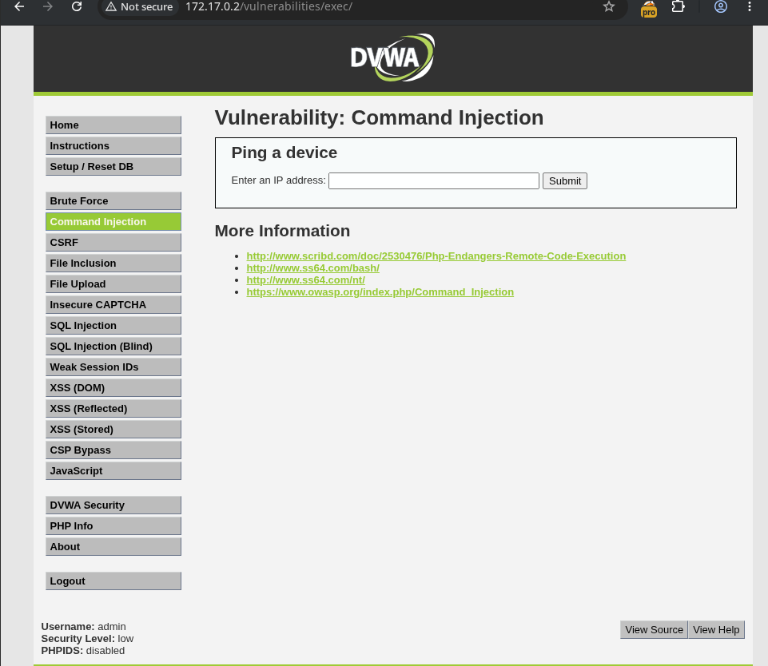

### Step 1 — Baseline behavior
We first test the feature using our own IP address. The application simply pings the given IP and returns the output.
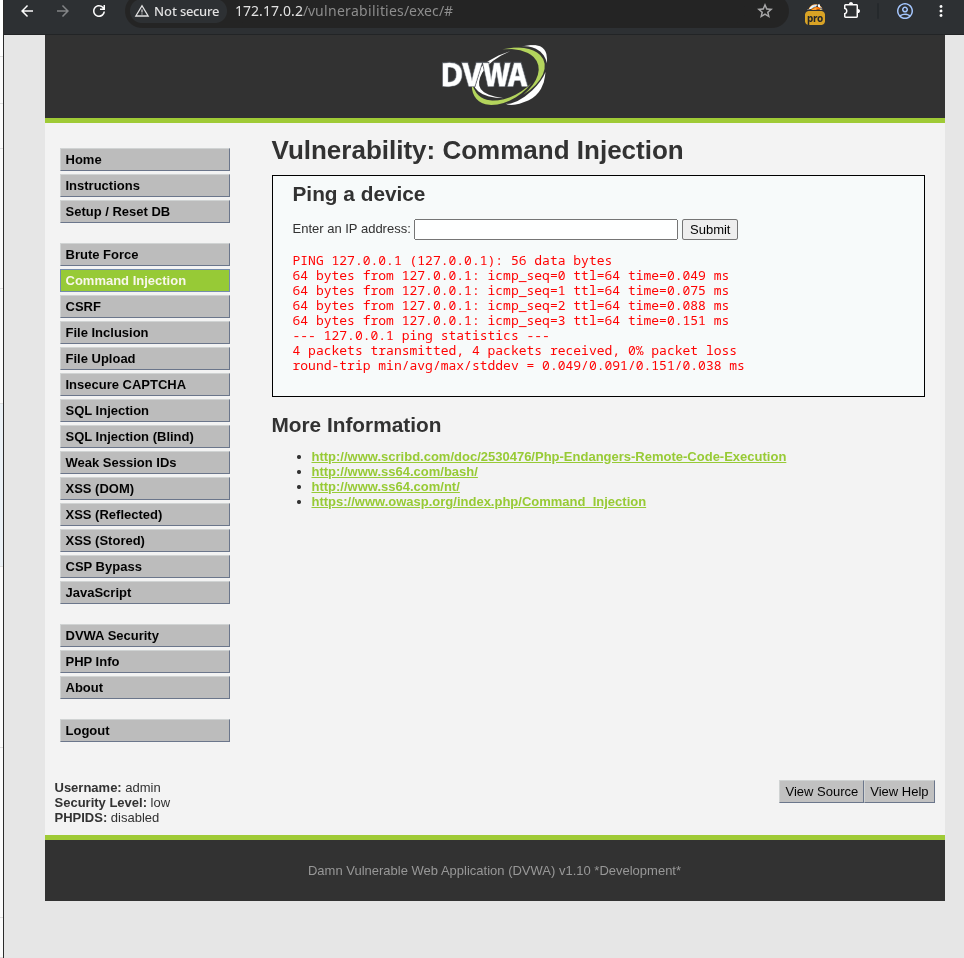

### Step 2 — Intercept and inspect
We capture the request in Burp Suite and examine both the request and response.

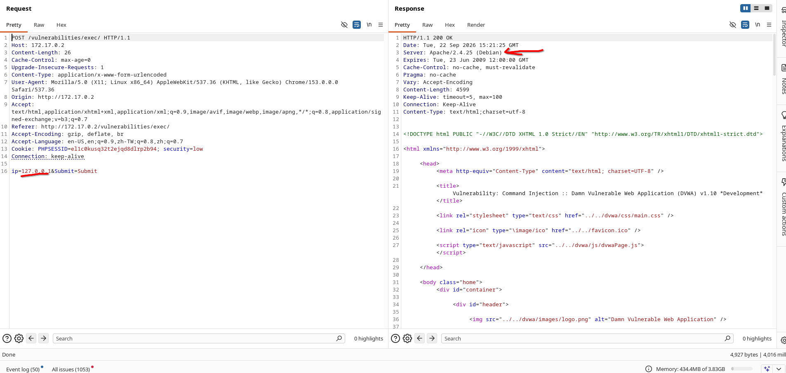

From the response headers we can see the server is **Debian-based**. Knowing the underlying OS lets us target Linux command chaining/injection operators.

### Step 3 — Injection attempt
We send the following payload in the IP parameter:

```
;ls
```

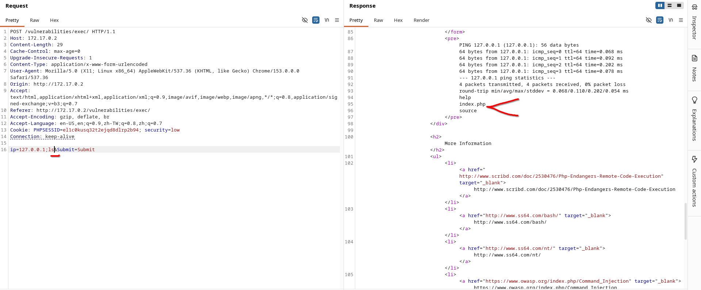

### Result
The response returns a directory listing of internal server files. This confirms the application is **vulnerable to OS Command Injection** at the Low security level — the `;` operator is not sanitized or filtered at all.

---

## Security Level: Medium
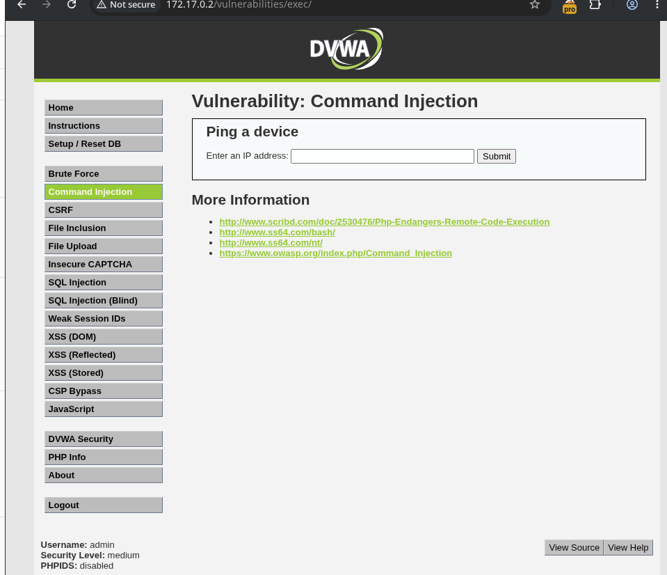

### Step 1 — Retry the Low-level payload
Using the same approach as before, we try `;ls`. This time the request only pings the given IP — the second command is **not** executed. This indicates some filtering is now in place.

### Step 2 — Try alternate operators
We test other Linux command-chaining operators to see which ones bypass the filter:

- `&`
- `|`
- `&&`

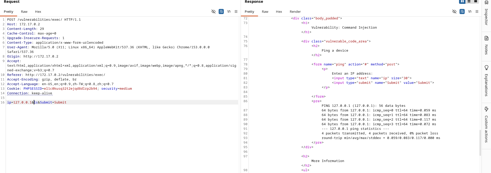

### Step 3 — Successful payload
```
|ls
```

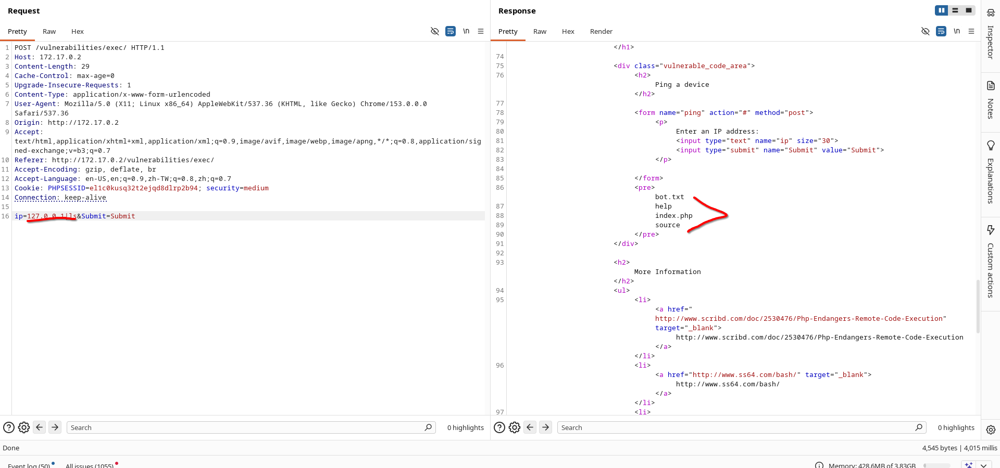

### Result
The `|` (pipe) operator is not filtered, and the second command executes successfully, returning internal file listings. This confirms the application is **vulnerable to Command Injection** at the Medium security level — the filter only blacklists `;` (and possibly a couple of others), not `|`.

---

## Security Level: High

### Step 1 — Baseline test
We try the normal payload first (`;ls`) and observe the response.

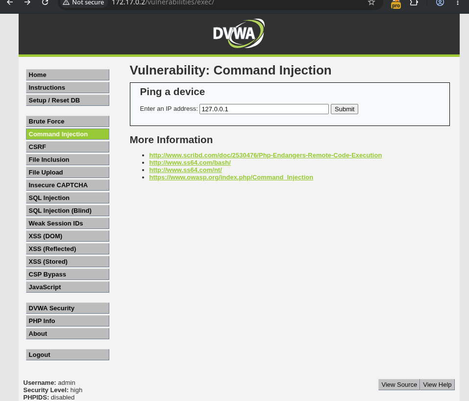

The `;` character is being URL-encoded to `%3B` by the input filter/handling, effectively neutralizing it. Manually changing it back to a literal `;` in Burp results in no output/response — confirming `;` is filtered at this level.

### Step 2 — Try the pipe operator
We attempt the same operator that worked at Medium level:

```
127.0.0.1|ls
```

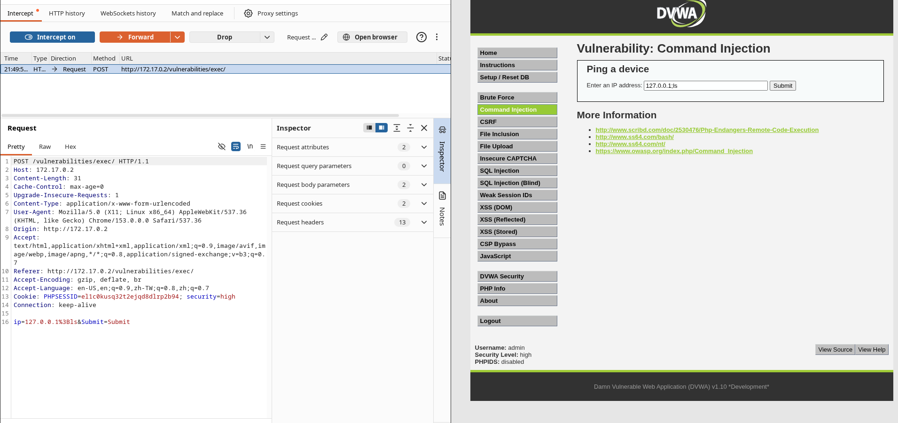

### Result
The payload succeeds and returns a directory listing showing internal files on the server:

```
bot.txt
help
index.php
source
```

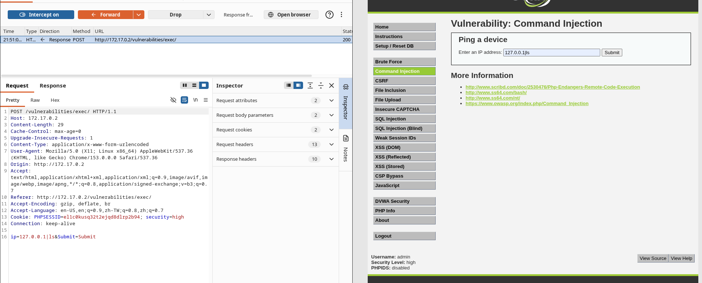
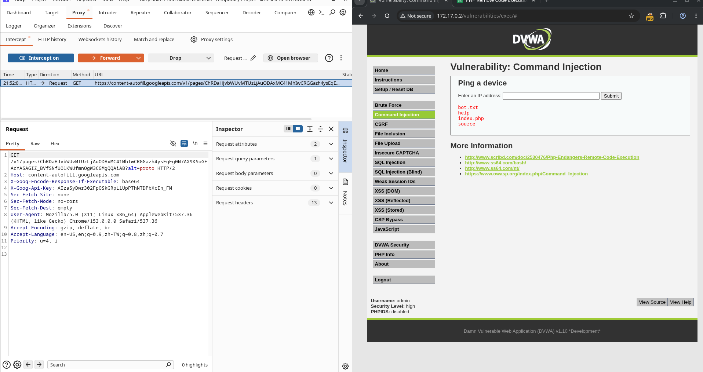

This confirms that even at the **High** security level, the application remains **vulnerable to Command Injection**, because the `|` operator is not included in the server-side blacklist/filter — only `;` (and similar characters) are sanitized.

---

## Summary

| Level  | Filter Behavior | Working Payload | Vulnerable? |
|--------|------------------|------------------|--------------|
| Low    | No filtering | `;ls` | ✅ Yes |
| Medium | Blocks `;`, allows `\|`, `&`, `&&` variably | `\|ls` | ✅ Yes |
| High   | URL-encodes/filters `;`, but not `\|` | `127.0.0.1\|ls` | ✅ Yes |

**Root cause:** Blacklist-based input filtering (blocking specific characters like `;`) instead of proper input validation/allow-listing and use of safe APIs (e.g., avoiding shell execution of user input entirely). An attacker can always find an unfiltered shell metacharacter (`|`, `&`, backticks, `$()`, newlines, etc.) to bypass a blacklist.

**Recommended remediation:**
- Avoid passing user input directly to shell commands.
- Use language-native networking libraries (e.g., a ping/ICMP library) instead of shelling out.
- If shelling out is unavoidable, strictly validate input against a whitelist (e.g., regex for valid IPv4/IPv6 only) and use parameterized/escaped execution (e.g., `escapeshellarg`).
- Run web application processes with least privilege.